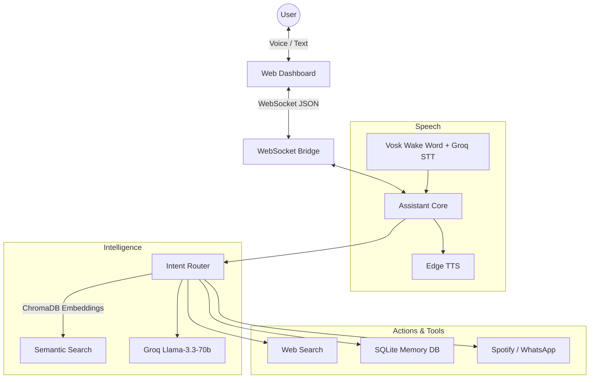

# Charlie v2 - Architecture Overview

Charlie v2 is a fully asynchronous, real-time, voice-enabled AI assistant. It bridges a modern web-based dashboard with a powerful Python backend using a bidirectional WebSocket connection.

## System Diagram

## Core Components

### 1. The Dashboard (`dashboard/index.html`)
- **Technology**: Pure HTML/JS/CSS with zero frontend frameworks for maximum performance.
- **Design**: Premium Glassmorphism UI, fully responsive.
- **Features**:
  - WebSocket client for real-time bidirectional communication.
  - Native HTML5 `<audio>` pipeline queue for seamless MP3 streaming.
  - Real-time Audio Visualizer (`AudioContext` AnalyserNode).
  - Multi-user authentication overlay.

### 2. The Core (`core/`)
- **`assistant.py`**: The central orchestrator. It manages the `asyncio` event loop, routes text/audio payloads, and handles background tasks like the scheduled reminder loop.
- **`websocket_bridge.py`**: The WebSocket server. It maintains client connections, handles authentication state (`auth_user_id`), and dispatches incoming messages to the Assistant via registered callbacks.
- **`intent_router.py`**: The decision engine. It uses a local ChromaDB instance to embed user queries and semantically match them against known intents (`chat`, `web_search`, `weather`, etc.).

### 3. Speech Processing (`speech/`)
- **STT (Speech-to-Text)**: Uses `vosk` and `pyaudio` for localized, offline Wake Word detection. Once triggered, it records audio and streams it to Groq's Whisper API for near-instant transcription.
- **TTS (Text-to-Speech)**: Uses `edge-tts` (Microsoft's Cloud Neural Voices) for ultra-realistic speech. The TTS pipeline is entirely asynchronous and generates streaming MP3s. If the dashboard is disconnected, it falls back to native invisible local playback via Windows Multimedia (`winmm.dll`).

### 4. Intelligence & Memory (`llm/`, `core/memory.py`)
- **LLM**: Powered by Groq's Llama-3.3-70b-versatile for sub-second generation. The system prompt is specifically engineered to generate conversational, fluid responses designed for voice synthesis, while also supporting UI actions like automatically opening URLs.
- **Memory**: An SQLite database (`SQLAlchemy`) stores long-term facts about users, enabling Charlie to remember preferences across sessions.

## Execution Flow (Voice Interaction)
1. User says "Charlie".
2. `Vosk` detects the wake word locally -> triggers `Groq STT` recording.
3. Transcription is sent to `intent_router.py`.
4. `ChromaDB` matches the intent (e.g., General Chat).
5. `Groq LLM` generates a response.
6. `assistant.py` awaits `edge-tts` to convert the text to MP3.
7. MP3 base64 data is blasted over the WebSocket to the Dashboard.
8. Dashboard decodes and plays the audio via HTML5 `<audio>` while visualizing the waveform.
